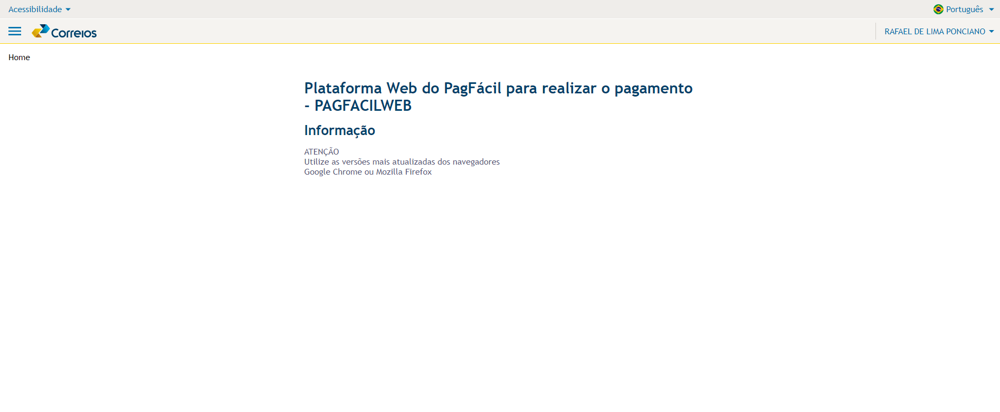
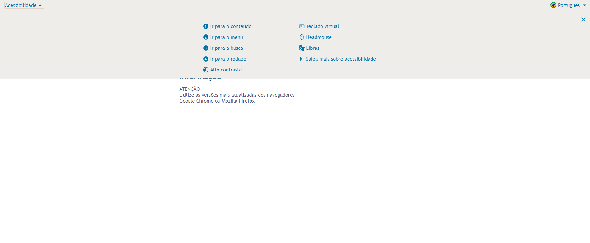

# accessibility-repo

- Código acessível → semântica, estilos, atributos de acessibilidade
    - inimigos da acessibilidade / problemas mais comuns
    - Refatorar um código
- Testar na pratica com código

---

### semântica, estilos, atributos de acessibilidade
Semântica Adequada: O uso correto de elementos HTML semânticos é crucial para garantir que a estrutura da página seja clara e compreensível para todos os usuários, incluindo leitores de tela. Isso inclui o uso apropriado de elementos como ``<header>, <nav>, <main>, <footer>``, entre outros, para descrever corretamente a estrutura do conteúdo.

Estilos Acessíveis: Os estilos devem ser desenvolvidos de forma responsiva e com consideração às necessidades de acessibilidade. Isso inclui garantir um bom contraste entre cores de texto e fundo, fornecer tamanhos de fonte legíveis e permitir a navegação por teclado em todos os elementos interativos.

Atributos de Acessibilidade: A utilização adequada de atributos como aria-* é essencial para descrever a interação e o comportamento dos elementos da interface de usuário para tecnologias assistivas. Por exemplo, aria-label, aria-labelledby e aria-describedby são usados para fornecer etiquetas e descrições adicionais a elementos semânticos, garantindo uma compreensão completa do conteúdo.

---

#### inimigos da acessibilidade / problemas mais comuns
- Vídeos
    - Sem legendas
    - Sem libras
    - Sem autodescrição
- Formulários
    - Sem descrição dos campos
    - Sem sinalização de erros
    - Sem validação dos campos individualmente (saber que preciso preencher email apenas depois do subtmit)
- Textos
    - Sem áudio
    - Confusos e ambíguos
    - Alinhamento errado
    - Longos e cansativos
- Componentes de tela
    - Captcha
    - Pop-ups
    - Layout confuso
    - Imagens sem descrição
    - Botões e links
    - Itens clicáveis
    - Contraste do texto e imagem
    - Tamanho das áreas clicáveis
    - **Botões de ícone**: sem texto o leitor de tela não reconhece sobre o que é o botão

---

### Componentes presente no repo
 - modal
 - checkbox
 - menu acordeon
 - radio button

### testes
 - modal
 - menu acordeon

---

Exemplo CORREIOS :

